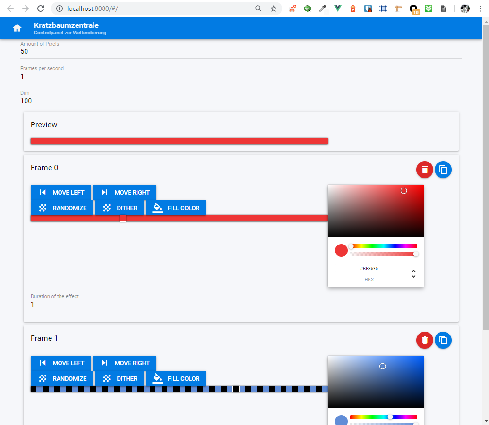

# ledstrip-animator
:bulb: Server and webapp to create custom sequences and effects for ledstrips

---

Originally based off of https://github.com/Zefiro/wodo-raspi-light
All attribution goes to [@Zefiro](https://github.com/Zefiro) for preparing the base of this app and for introducing me to the magic of nodejs-controlled IoT.

I talked about this at StuttgartJS - see the slides here: https://slides.com/martinmuzatko-1/iot/

## Preview

### UI
Create scenes by defining frames, amount of pixels and duration of selected colors


### Ledstrip


## Setup

I used a Raspberry 3B with GPIO 18. More pictures to come.

## Install

```
npm i ledstrip-animator
```

## Development

Server:
```
npm run dev
```

Front-end:
```
cd public
quasar dev
```
